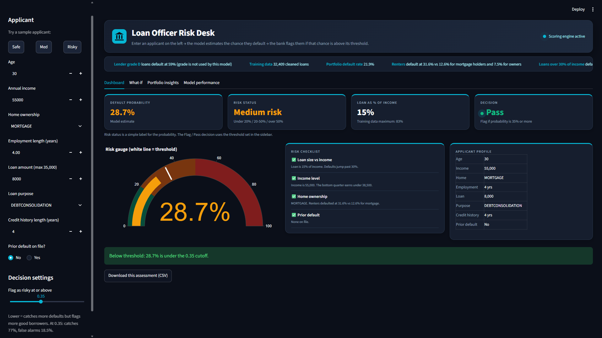
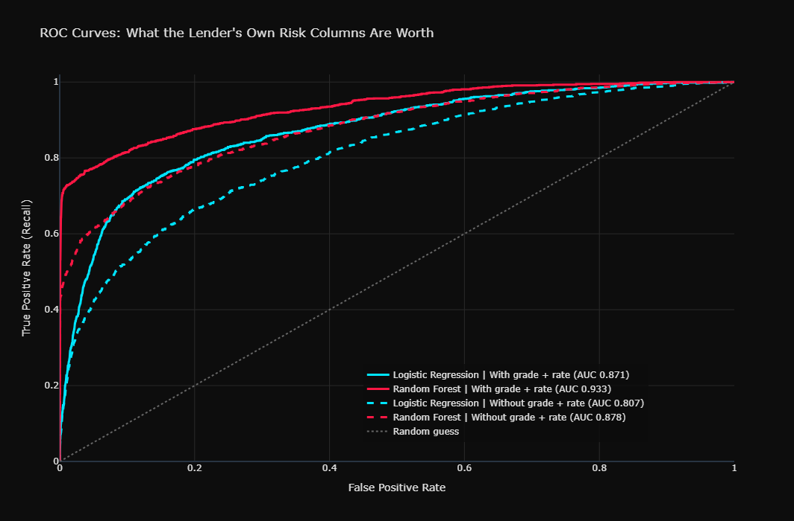
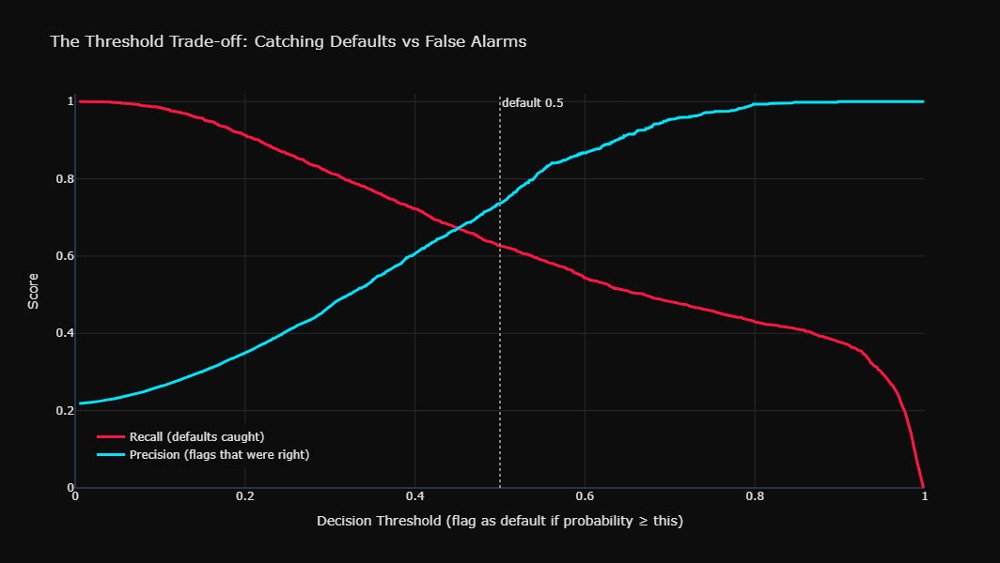
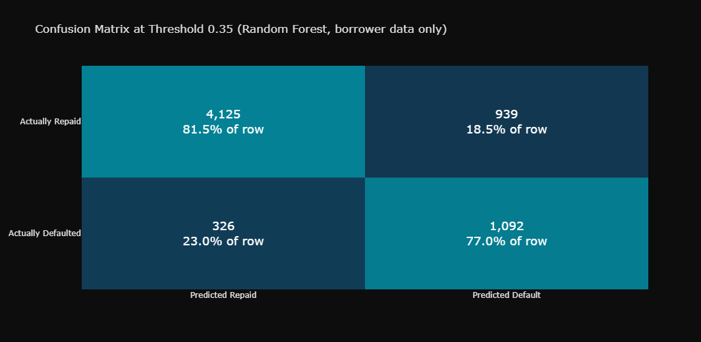
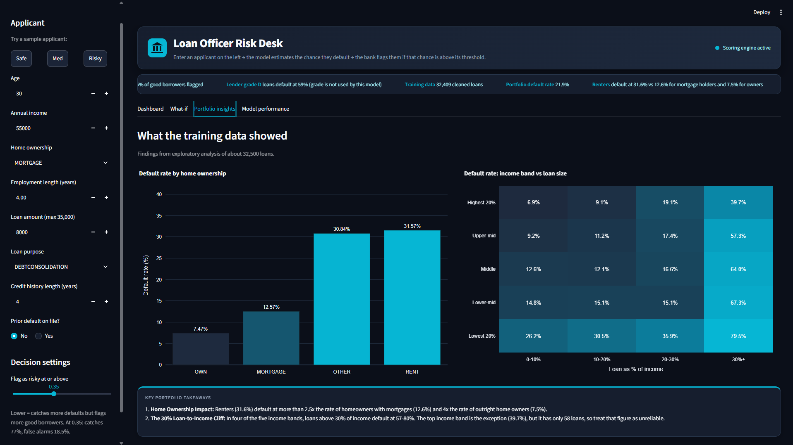
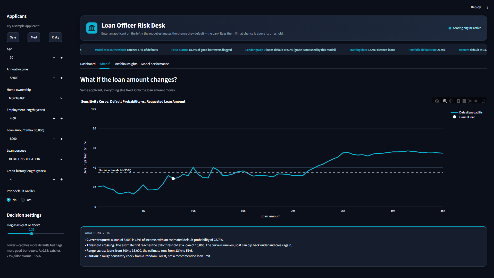
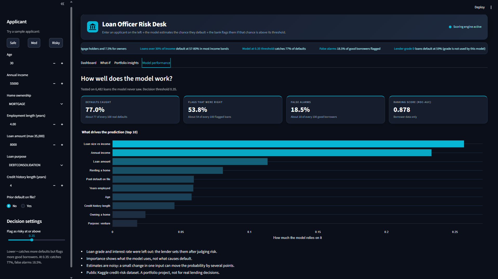

# Loan Default Risk Analyzer

A Streamlit app and analysis notebook that estimate the chance a borrower defaults, using borrower data only.



## Main finding

A Random Forest that sees **only borrower data** reached a ROC-AUC of **0.878** on held-out loans. A simpler Logistic Regression that was *also given the lender's own loan grade and interest rate* scored **0.871**.

Grade and rate are set by the lender after it has already judged the risk, so using them to predict risk is partly circular. I left them out of the final model and report them only as a benchmark.



## Model comparison

All four runs use the same 80/20 stratified split (25,927 training loans, 6,482 test loans). Scores are at the default 0.5 cutoff.

| Features | Model | Recall | Precision | F1 | ROC-AUC |
|---|---|---|---|---|---|
| With grade + rate | Logistic Regression | 0.781 | 0.538 | 0.637 | 0.871 |
| With grade + rate | Random Forest | 0.766 | 0.845 | 0.804 | 0.933 |
| Without grade + rate | Logistic Regression | 0.704 | 0.442 | 0.543 | 0.807 |
| **Without grade + rate** | **Random Forest** | 0.626 | 0.736 | 0.677 | **0.878** |

Only 22% of loans default, so accuracy would be misleading. I evaluated on recall, precision and ROC-AUC, and trained with balanced class weights.

## Choosing the decision threshold

At the default 0.5 cutoff the final model misses 37% of real defaults. Lowering the cutoff catches more defaults but flags more good borrowers.



I chose **0.35**. On the test set:



- Defaults caught: **77.0%** (1,092 of 1,418)
- Flags that were real defaults: **53.8%**
- Good borrowers wrongly flagged: **18.5%** (939 of 5,064)
- Share of all loans flagged: 31.3%

I have no real cost figures for a missed default versus a declined good borrower, so 0.35 is a judgment call, not a derived optimum. The app has a slider to change it.

## What the data showed

- **Loan size vs income matters most.** In four of the five income bands, loans above 30% of income default at 57-80%. The top income band is the exception (39.7%), but it has only 58 loans, so that figure is unreliable.
- **Renters default more.** 31.6% for renters, against 12.6% for mortgage holders and 7.5% for owners.
- **Affordability drives the model.** Loan size vs income (0.257), income (0.233) and loan amount (0.113) make up about 60% of the model's feature importance.
- **The lender's grade is nearly a verdict.** Default rates run from 10.0% (grade A) to 59.1% (grade D). Grades F and G have few loans (241 and 64), so I don't read much into them.



## The app

Enter an applicant in the sidebar and the app shows the default probability, a risk band, a Flag/Pass decision at your chosen threshold, and a checklist based on the patterns above.

- **Dashboard:** probability gauge, risk checklist, applicant profile, CSV download of the assessment
- **What-if:** how the estimate changes as the loan amount moves
- **Portfolio insights:** the findings from my exploratory analysis
- **Model performance:** test-set results and what drives the prediction
- Three sample applicants (Safe, Med, Risky) and warnings when an input is outside the range the model was trained on





## Data and method

1. **Data:** Credit Risk Dataset by laotse (Kaggle), `credit_risk_dataset.csv`, 32,581 rows. The raw file is not included in this repository.
2. **SQL exploration** in SQLite: default rates by grade and home ownership, and outlier checks.
3. **Cleaning:** removed 165 duplicate rows, 5 rows with age over 100 and 2 with employment length over 60 (32,409 loans left, 21.9% default rate). Missing interest rates were filled with the median for the same loan grade, and missing employment length with the overall median.
4. **Modelling:** Logistic Regression and Random Forest, with and without the lender's grade and rate.
5. **App:** Streamlit, loading the saved model.

## Limitations

- **Estimates are noisy.** Changing one input slightly can move the probability by several points (for example, age 30 to 31 moved one estimate from 28.7% to 24.9%). Treat the number as a screening signal, not a precise probability.
- **Sparse regions are unreliable.** Very low incomes and loans above the 83% loan-to-income maximum in the training data have few similar examples.
- **The 0.35 threshold was chosen by looking at the test set**, so the reported figures are slightly optimistic.
- **Missing values were filled before the train/test split**, which leaks a small amount of information. A stricter version would impute inside a pipeline.
- **Importance is not causation.** Feature importance shows what the model relies on, not what causes default.
- This is a portfolio project on one public dataset, **not for real lending decisions**.

## Run it locally

Tested with Python 3.12 on Windows (PowerShell).

```powershell
git clone https://github.com/thakresrushti04/loan-default-risk-analyzer.git
cd loan-default-risk-analyzer
python -m venv .venv
.venv\Scripts\python.exe -m pip install -r requirements.txt
.venv\Scripts\python.exe -m streamlit run app.py
```

## Repository contents

```
app.py                  Streamlit app
requirements.txt        pinned library versions
risk_model.joblib       trained Random Forest (borrower data only)
model_meta.joblib       column order, threshold, dropdown options
.streamlit/config.toml  theme
notebooks/              full analysis notebook (Colab)
images/                 screenshots used in this README
```

Some interactive Plotly charts may not display in GitHub's notebook preview, which is why the key charts are saved as images.

## Tools

Python, Pandas, NumPy, SQLite, scikit-learn, Plotly, Streamlit

Built by Srushti Thakre.